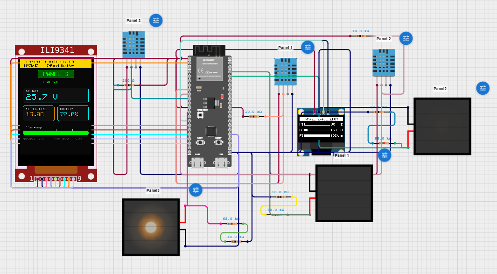
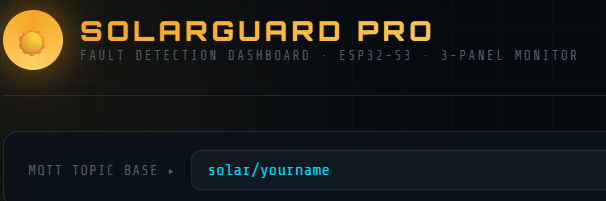
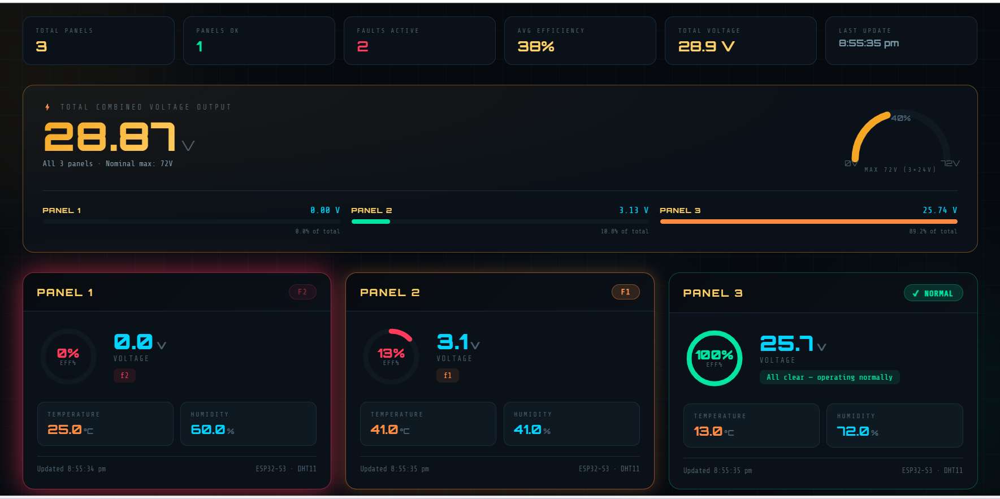
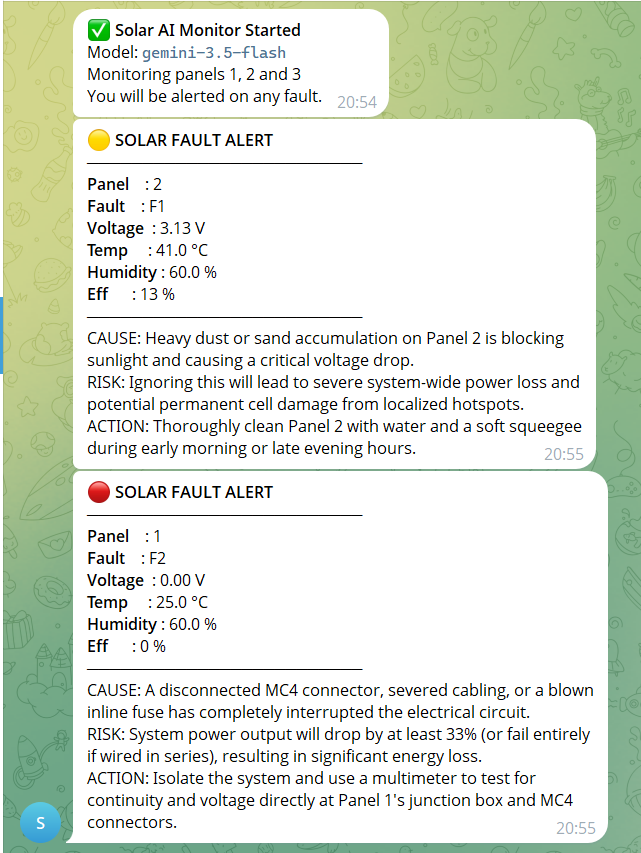

# Solar Panel Monitoring and Fault Detection System Using AI

A real-time, three-panel solar monitoring system built on the ESP32-S3, combining local sensor acquisition, dual-display feedback, MQTT-based cloud communication, and Google Gemini LLM-powered fault diagnosis delivered via Telegram — enabling autonomous, human-readable fault alerts without manual site inspection.

> **Note:** Firmware (C++/Arduino) and the Python AI-subscriber source are kept private. This README documents the system architecture, design decisions, and validated results. Circuit simulation files are available on request.

## Overview

Solar installations commonly suffer three under-monitored fault modes: dust/sand accumulation reducing output, dead/disconnected panels, and hotspot formation from thermal anomalies — all of which typically go undetected until the next manual inspection. This system continuously monitors three independent panels, classifies faults in real time using a deterministic threshold algorithm, and — instead of just reporting a raw fault code — queries Google Gemini to generate a structured, plain-language diagnostic (cause, risk, recommended action) that's pushed straight to a Telegram bot for field operators.

## System Architecture

The system is organized as a three-tier pipeline:

1. **Sensor & signal conditioning (Tier 1)** — per-panel voltage sensing (resistive divider) and DHT11 temperature/humidity acquisition, with oversampling and retry logic for noise/error resilience.
2. **Local processing, classification & display (Tier 2)** — the ESP32-S3 runs deterministic fault classification and drives an OLED efficiency dashboard plus a TFT panel-detail display.
3. **Cloud communication & AI diagnosis (Tier 3)** — sensor/fault data is published over MQTT; a subscriber process queries Gemini on fault detection and delivers the diagnosis via Telegram.

*Cirkit Designer simulation layout — three-panel monitoring node with ESP32-S3, voltage dividers, DHT11 sensors, OLED, and ILI9341 TFT LCD.*
## How to use Website
Download `solarguard_2 (1)` from this repository then in  in this website just change `solar/yourname` to `solar/fault`. Then press connect.

## Hardware

| Component | Specification | Qty | Function |
|-----------|----------------|-----|----------|
| Microcontroller | ESP32-S3 DevKit, dual Xtensa LX7 @ 240 MHz, Wi-Fi | 1 | Central processing unit |
| OLED Display | SSD1306, 128×64, I²C | 1 | Efficiency dashboard |
| TFT LCD Display | ILI9341, 240×320, SPI | 1 | Per-panel detail view |
| DHT11 Sensor | Temp 0–50°C ±2°C, RH 20–90% ±5% | 3 | Temperature / humidity sensing |
| Resistor (upper leg) | 68 kΩ, 1/4 W | 3 | Voltage divider |
| Resistor (lower leg) | 10 kΩ, 1/4 W | 3 | Voltage divider |
| Pull-up Resistor | 10 kΩ, 1/4 W | 3 | DHT11 data line bias |
| Power Supply | 5V / 2A USB | 1 | System power |

**Voltage sensing:** A 10 kΩ / 68 kΩ divider (≈7.8:1) scales the 24V nominal panel output down to the ESP32's 0–3.3V ADC range, with 16-sample oversampling to suppress Wi-Fi-induced ADC noise.

**Pin assignments:**

| Interface | Signal | ESP32-S3 Pin |
|-----------|--------|--------------|
| OLED (I²C) | SDA | GPIO8 |
| OLED (I²C) | SCL | GPIO9 |
| TFT (FSPI) | MOSI | GPIO11 |
| TFT (FSPI) | CLK | GPIO12 |
| TFT (FSPI) | MISO | GPIO13 |
| TFT (FSPI) | CS | GPIO10 |
| TFT (FSPI) | DC | GPIO14 |
| TFT (FSPI) | RST | GPIO21 |

## Fault Classification Logic

The system defines three fault categories on top of normal operation, prioritized F2 → F1 → F3 so the most severe condition is always reported:

| Fault Code | Condition | Threshold | Probable Cause |
|------------|-----------|-----------|-----------------|
| OK | Normal operation | V ≥ 10V, T < 50°C | No fault detected |
| F1 | Low voltage | 0.5V ≤ V < 10V | Dust / sand accumulation |
| F2 | Zero voltage | V < 0.5V | Panel dead / disconnected |
| F3 | Overtemperature | T ≥ 50°C | Hotspot formation |

Classification runs in under 50 ms per cycle directly on the ESP32-S3.

## Cloud Communication & AI Diagnosis

- Each panel publishes JSON sensor/fault data (voltage, temperature, humidity, efficiency, fault code) to a dedicated MQTT topic on the public HiveMQ broker.
- A subscriber process monitors all three topics and, on a qualifying fault event (with cooldown to suppress repeated alerts for persistent faults), builds a structured prompt describing the fault, sensor readings, and system context.
- This prompt is sent to the **Google Gemini API**, which returns a strict three-line diagnosis: **cause, risk, action**.
- The diagnosis is formatted and pushed to operators via the **Telegram Bot API**, with fault-specific visual indicators (🟡 F1, 🔴 F2, 🔥 F3).
- API calls use exponential backoff (10s / 30s / 60s) to handle rate limits, with a local fallback message ensuring alerts are never silently dropped.

## Displays

- **OLED (128×64, I²C):** three-row efficiency dashboard with per-panel progress bars and fault indicators, updated every acquisition cycle.
- **TFT (240×320, SPI, ILI9341):** cycling per-panel detail screens — normal screens show voltage/temperature/humidity/efficiency; fault screens show an animated fault-specific icon with a countdown, refreshing in ~50 ms at up to 40 MHz SPI.

## Validation

The full circuit was simulated in **Cirkit Designer** before physical assembly — verifying pin assignments, voltage divider scaling, DHT11 timing, and SPI/I²C display initialization. Fault conditions were injected by adjusting simulated panel voltages (below 0.5V for F2, 2–9V for F1, nominal for OK), and the classification and MQTT payload output were confirmed correct.

Telegram alert delivery was validated end-to-end against a physical ESP32-S3 board publishing to the same HiveMQ broker used in simulation.

## Results

### Live Monitoring Dashboard

*Live dashboard showing Panel 1 in F2 fault (0.00V), Panel 2 in F1 fault (3.13V), and Panel 3 operating normally (25.7V). Total output: 28.87V, average efficiency: 38%.*

### AI-Generated Telegram Alerts

*Real Telegram alerts generated by Gemini — an F1 dust-accumulation fault on Panel 2, and an F2 disconnection fault on Panel 1, each with cause/risk/action guidance.*

### Performance Summary

| Parameter | Measured / Observed |
|-----------|----------------------|
| Voltage measurement accuracy (MAE) | 0.31V (1.8% of 24V nominal) |
| Temperature measurement accuracy | Within ±2°C (DHT11 spec) |
| Fault classification latency | < 50 ms per cycle |
| MQTT publish latency (LAN) | < 150 ms average |
| AI diagnostic response time | 3.2s average (Gemini API) |
| Telegram message delivery time | < 1s from AI response |
| Fault classification accuracy | 100% (20 test scenarios) |
| AI diagnosis relevance | 100% (20 scenarios, manual eval) |
| System uptime (48-hour test) | 99.6% (one auto-recovered Wi-Fi dropout) |
| Cooldown false-positive suppression | 100% (no duplicate alerts) |

## Key Design Decisions

- **Deterministic thresholds over ML classifiers** — avoids the need for labelled training data or GPU inference hardware, while still achieving 100% classification accuracy across all tested scenarios.
- **LLM-based diagnosis instead of static fault-code lookup** — Gemini generates contextual, operator-readable guidance rather than a bare code, useful for field staff without deep electrical expertise.
- **Priority-ordered fault detection (F2 > F1 > F3)** — ensures the most severe condition is always surfaced when multiple criteria are met simultaneously.
- **Cooldown-gated AI queries** — prevents redundant API calls and alert spam for a fault that persists across multiple sensor cycles.
- **Retry-with-fallback on AI calls** — guarantees a Telegram alert is always sent, even if the Gemini API is rate-limited or unavailable.

## Limitations & Future Work

- No galvanic isolation on the voltage-sensing circuit — a consideration for higher-voltage deployments.
- DHT11 accuracy/resolution is a limiting factor; DHT22/SHT31 would improve thermal fault discrimination.
- AI diagnosis is currently stateless per fault event — no historical trend awareness (e.g. distinguishing a recurring cleaning issue from an isolated dust storm).
- Scaling beyond 3 panels would benefit from hierarchical MQTT topics and a time-series dashboard (e.g. Grafana + InfluxDB).

## Author

Shreeraj Pradeep Patil — B.Tech Electronics & Communication Engineering, CHARUSAT
